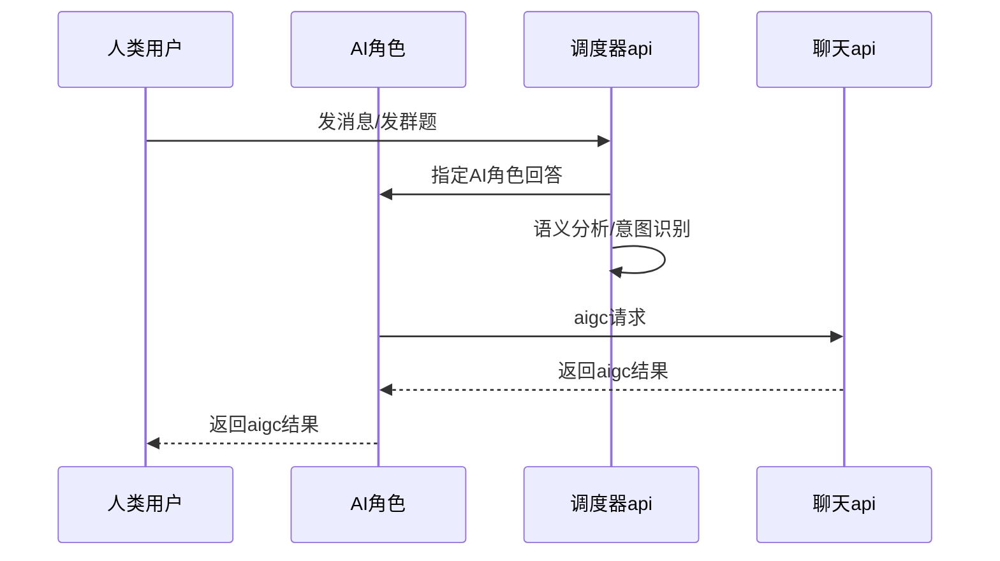

```mermaid
sequenceDiagram
    participant User as 人类用户
    participant AI as AI角色
    participant Scheduler as 调度器api
    participant ChatAPI as 聊天api

    User->>Scheduler: 发消息/发群题
    Scheduler->>AI: 指定AI角色回答
    Scheduler->>Scheduler: 语义分析/意图识别
    AI->>ChatAPI: aigc请求
    ChatAPI-->>AI: 返回aigc结果
    AI-->>User: 返回aigc结果
```

