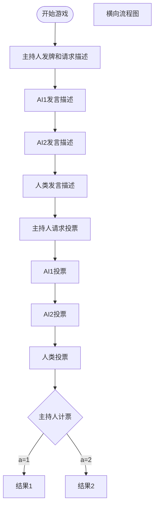

# 《谁是卧底》游戏群

```mermaid
graph TD
A([开始游戏]) -->B[主持人发牌和请求描述]
    B --> C[AI1发言描述]
    C --> D[AI2发言描述]
    D --> F[人类发言描述]
    F --> G[主持人请求投票]
    G --> H[AI1投票]
    H --> I[AI2投票]
    I --> J[人类投票]
    J --> K{主持人计票}
    K -->|a=1| D1[结果1]
    K -->|a=2| E1[结果2]
    F1[横向流程图]
```